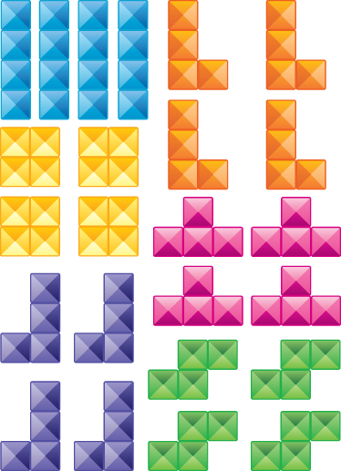

# Fillit
3rd project of [42 School](https://www.42.fr) "Introduction to C" Branch.

This project was produced by a group of 2 students.

## Description

This project is loosely inspired by the Tetris game.



The goal of this project is to make the smallest possible "square" (which can contain holes) with a given list of tetriminos, but the disposition must be as such that it returns the first possible solution when placing them recursively from the top left.

This project introduces the concept of backtracking algorithms.

## Usage

```
$> make
$> ./fillit file.fillit
```

## Example

```
$> ./fillit ../jeu_test/valide/jeu31

ABBBCCF.
A.BDCCFF
A.DDDEEF
AGGHHHEE
J.G..HII
J.GKMII.
JKKKMMLL
J...M.LL
```
